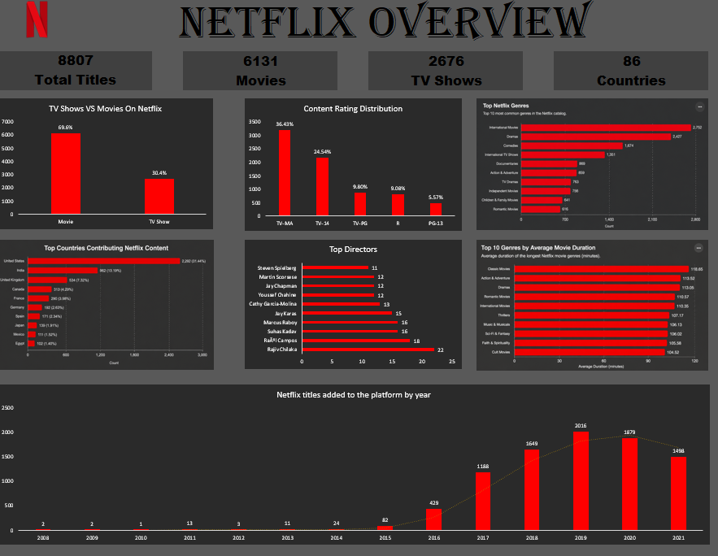

# Netflix Content Analysis Dashboard

## Project Overview
This project provides a comprehensive analysis of Netflix's content library, utilizing **PostgreSQL** for data extraction, **Power Query** for ETL (Extract, Transform, Load) processes, and **Excel** for visualization and reporting.

The objective of this analysis was to uncover key insights regarding content strategy and platform evolution, specifically:

* **Content Distribution:** Comparison between Movies and TV Shows.
* **Rating Trends:** Analysis of content maturity ratings (e.g., TV-MA, PG-13).
* **Top Genres:** Identification of the most prevalent genres in the library.
* **Geographic Insights:** Determining the top contributing countries to Netflix's library.
* **Creative Influence:** Highlighting the most prolific directors.
* **Duration Metrics:** Calculating the average movie duration segmented by genre.
* * **Growth Over Time:** Tracking Netflix's content additions and catalog expansion over time.

---

## Tools Used
* **PostgreSQL:** Data storage and complex query execution.
* **Power Query:** Data cleaning, transformation, and normalization.
* **Excel:** Dashboard creation and data visualization.

---

## Dataset

**Source:** Netflix Titles Dataset

The dataset contains information about movies and TV shows available on Netflix, including title, type, director, cast, country, release year, rating, duration, genres, and date added.

---

## Dashboard Preview



---

## Key Insights
* **Content Split:** Movies account for 69.6% of Netflix's catalog.
* **Rating Distribution:** TV-MA is the dominant content rating across the platform.
* **Top Genre:** International Movies represent the largest share of the library.
* **Top Producer:** The United States contributes the highest number of titles.
* **Growth Trend:** Netflix experienced rapid content growth between 2016 and 2019.

---

## Final Conclusion
Netflix's catalog is primarily movie-focused, with strong emphasis on mature audiences and international productions. The platform expanded aggressively between 2016 and 2019, reflecting a strategy centered on global content acquisition and subscriber growth.

## Repository Structure

```text
Netflix-Content-Analysis
│
├── Dashboard
├── Dataset
├── Images
├── SQL Queries
└── README.md
